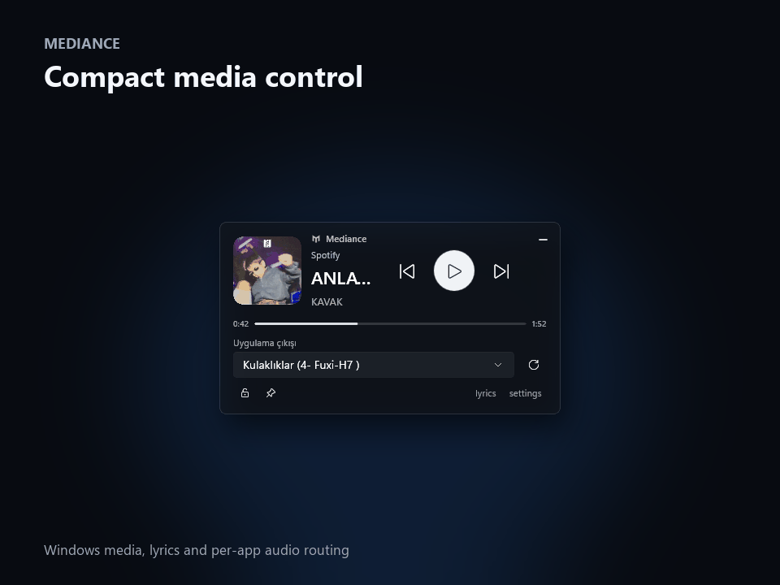

<p align="center">
  
</p>

<h1 align="center">Mediance</h1>

<p align="center">
  A compact media companion for Windows 11.<br>
  Control playback, follow synchronized lyrics, and route an app to a different audio device without leaving your desktop.
</p>

<p align="center">
  <a href="README.tr.md">Türkçe</a> ·
  <a href="docs/INSTALLATION.md">Install</a> ·
  <a href="docs/WALKTHROUGH.md">Walkthrough</a> ·
  <a href="docs/FAQ.md">FAQ</a> &middot;
  <a href="docs/BETA_QUALITY.md">Beta quality</a> &middot;
  <a href="docs/MARKETING.md">Marketing kit</a>
</p>

> The latest public beta is available from [GitHub Releases](https://github.com/S1lahsizKuvv3t/Mediance/releases/tag/v0.9.0-beta.2). Signed installers and automatic updates are still on the release checklist.

<p align="center">
  
</p>

## Feature overview

| Area | What Mediance provides |
|---|---|
| Media | Preferred-session selection, play/pause, previous/next, seeking, and stale-session recovery |
| Lyrics | Source-synchronized lyrics, on-device automatic alignment, local learning, timing offset, and two/three-line views |
| Audio | Per-application output-device selection and mouse-wheel application volume |
| Layouts | Standard, Micro, cover-and-controls, vertical lyrics, and a minimal configurable layout |
| Appearance | Acrylic glass, centered Album artwork theme, blur, zoom, darkness, width, and density controls |
| Desktop | Multi-monitor snapping, position lock, always-on-top, tray behavior, and a configurable global shortcut |
| Privacy | No account, telemetry, listening history, saved audio, or cloud speech transcription |

## What it does

Mediance sits on the desktop as a small Acrylic widget. It reads the media sessions already exposed by Windows, so it can work with Spotify, YouTube Music, browsers, and other compatible players without asking for an account or a browser extension.

- Play, pause, skip, and seek from one floating window.
- Prefer Spotify and YouTube Music over an unrelated browser video.
- Show synchronized lyrics with smooth line transitions and an adjustable timing offset.
- Automatically learn and keep local timings when only verified plain lyrics are available, with manual timing as a fallback.
- Choose a different output device for the selected media app without changing the system-wide default.
- Hide individual parts of the widget and tune its width, artwork, text, controls, glass density, and theme.
- Use the Album theme to turn the current cover into a smoothly animated, readable background.
- Pin the widget above other windows, lock its position, snap it to either monitor, or hide it in the system tray.
- Keep games in the foreground: the widget does not appear in the taskbar or Alt+Tab and pointer clicks do not activate it.
- Show or hide it with a configurable global shortcut.

Mediance does not keep listening history or send telemetry. Lyrics are fetched only after the lyrics panel is opened. See the [privacy notes](docs/PRIVACY.md) for the exact data flow.

## Requirements

- Windows 11 24H2 or newer
- x64 processor
- A media application that publishes a Windows media session

The release build is self-contained. Users do not need to install the .NET SDK or Windows App SDK separately.

## Install a beta build

1. Download `Mediance-<version>-win-x64.zip` from GitHub Releases.
2. Extract the whole archive to a normal folder.
3. Run `Mediance.exe` from that folder.

The package root contains only the launcher, so `Mediance.exe` is easy to find. Keep the adjacent `App` folder in place because it contains the self-contained application files. Until releases are code-signed, Windows SmartScreen may show an unknown publisher warning.

The full instructions, update notes, and clean removal steps are in [Installation](docs/INSTALLATION.md).

## Using Mediance

Start music in a supported app and open Mediance. The widget follows the preferred session automatically. Drag it from any empty part of the glass surface, use the footer lock when it is in place, and open `settings` to change the layout.

The audio output selector affects the selected application only. Choosing **Default** returns that app to the Windows default device. Browser routing applies to the browser process rather than one individual tab.

Open `lyrics` to request lyrics for the current track. Source-authored synchronized lyrics always take priority. When only verified plain lyrics are available, optional on-device sync listens only to the selected media process in bounded 75-second samples, aligns a local speech transcript to the likely lyric region, and saves a result only when its confidence is high enough. It can start mid-track and retry later sections automatically. Manual timing remains available. The multilingual model is downloaded once on first use and audio is kept in memory rather than archived.

The [walkthrough](docs/WALKTHROUGH.md) covers every control and setting. Common questions are collected in the [FAQ](docs/FAQ.md).

## Build from source

You need Windows 11 and the .NET 10 SDK.

```powershell
git clone <your-fork-url>
cd Mediance
dotnet restore Mediance.slnx
dotnet build Mediance.slnx --configuration Release
dotnet test tests/Mediance.Core.Tests --configuration Release
```

The repository also contains a development helper:

```powershell
.\scripts\dev.ps1 build
.\scripts\dev.ps1 test
.\scripts\dev.ps1 glass-test
.\scripts\beta-check.ps1
```

Build output is written under `artifacts/` by the helper and is intentionally excluded from Git.

## Project layout

- `src/Mediance.Core` — portable media, settings, timing, and selection logic.
- `src/Mediance.Windows` — Windows media sessions, audio routing, and native window integration.
- `src/Mediance.Lyrics` — synchronized and plain lyrics providers, caching, and local timing storage.
- `prototypes/Mediance.AcrylicProbe` — the current WinUI 3 desktop application.
- `packaging/Mediance.Launcher` — the small native launcher placed at the top of release archives.
- `tests/Mediance.Core.Tests` — unit and reliability tests.
- `docs` — user guides and technical notes.

More detail is available in [Architecture](docs/ARCHITECTURE.md).

## Current status

The current build passes 97 automated tests and the native window smoke test. The live lyrics acceptance set has also passed 12 of 12 source-timed samples and 4 of 4 forced automatic-path samples on Spotify. Spotify playback controls and per-app output routing have also been checked on real hardware. The repeatable beta gate records live lyrics samples, source coverage, multi-monitor checks, sleep/wake recovery, and optional soak runs without marking unavailable hardware as passed. The remaining work before a signed 1.0 release is tracked in the [roadmap](docs/ROADMAP.md). Preview the upcoming changes in the [next beta release notes](docs/RELEASE_NOTES_NEXT.md).

Please use the issue templates for reproducible bugs and feature requests. For security reports, follow [SECURITY.md](SECURITY.md) rather than opening a public issue.

Repository owners can follow the one-time [GitHub setup checklist](docs/GITHUB_SETUP.md) before the first push.

## License

Copyright © 2026 Mediance. All rights reserved. No permission to redistribute modified builds or reuse the source is granted by the current license. This can be changed before the public launch if the project moves to an open-source license.

Third-party components and references are listed in [THIRD_PARTY_NOTICES.md](THIRD_PARTY_NOTICES.md).
