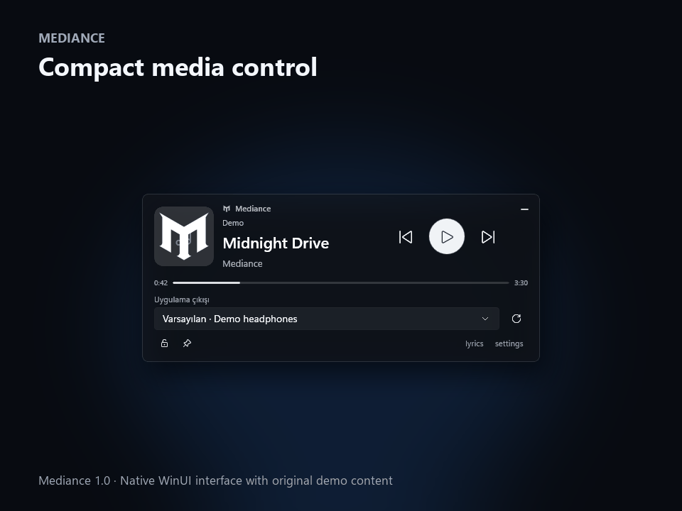

<p align="center">
  
</p>

<h1 align="center">Mediance</h1>

<p align="center">
  Windows 11 için kompakt bir masaüstü medya yardımcısı.<br>
  Oynatmayı kontrol edin, senkronize şarkı sözlerini takip edin ve uygulamanın ses çıkışını masaüstünden ayrılmadan değiştirin.
</p>

<p align="center">
  <a href="README.md">English</a> ·
  <a href="docs/INSTALLATION.md">Kurulum</a> ·
  <a href="docs/WALKTHROUGH.md">Kullanım rehberi</a> ·
  <a href="docs/FAQ.md">SSS</a> ·
  <a href="docs/RELEASE_NOTES_1.0.0.md">Sürüm notları</a> ·
  <a href="docs/MARKETING.md">Tanıtım paketi</a>
</p>

> **Mediance 1.0 yayınlandı.** [Windows x64 için indir](https://github.com/S1lahsizKuvv3t/Mediance/releases/latest) · [Neler değişti?](docs/RELEASE_NOTES_1.0.0.md)
> Windows 11 24H2 ve üzeri için taşınabilir ZIP. Tamamını çıkarın, `Mediance.exe` dosyasını açın. Hesap veya ayrı bir çalışma zamanı kurulumu gerekmez.

<p align="center">
  
</p>

Görseller gerçek WinUI arayüzünden, bize ait örnek kapak ve sözlerle üretilmiştir.

<p align="center"><br>Saatin yanında çalan parça</p>

## Özellik özeti

| Alan | Mediance ne sunar? |
|---|---|
| Medya | Tercihli oturum seçimi, oynat/duraklat, önceki/sonraki, seek ve donmuş oturum kurtarma |
| Lyrics | Kaynak senkronu, cihaz üzerinde otomatik eşleştirme, yerel öğrenme, timing offset ve iki/üç satır görünümü |
| Ses | Uygulamaya özel çıkış cihazı ve fare tekerleğiyle uygulama sesi |
| Görünümler | Standart, Micro, kapak + kontroller, dikey lyrics ve sadeleştirilebilir düzen |
| Görünüm | Acrylic cam, ortalanmış Album teması, blur, zoom, karartma, genişlik ve yoğunluk ayarları |
| Masaüstü | Görev çubuğu medya kapsülü, çoklu monitör hizalama, konum kilidi, sistem tepsisi ve değiştirilebilir global kısayol |
| Gizlilik | Hesap, telemetri, dinleme geçmişi, kayıtlı ses veya bulut konuşma çözümleme yok |

## Mediance ne yapar?

Mediance masaüstünde küçük bir Acrylic widget olarak durur. Windows'un mevcut medya oturumlarını kullandığı için Spotify, YouTube Music, tarayıcılar ve diğer uyumlu oynatıcılarla hesap bağlantısı veya tarayıcı eklentisi istemeden çalışabilir.

- Oynat, duraklat, önceki, sonraki ve zaman çizelgesinde ilerleme kontrolleri.
- Alakasız bir tarayıcı videosu yerine Spotify ve YouTube Music'e öncelik verme.
- Yumuşak geçişli senkronize şarkı sözleri ve ayarlanabilir zamanlama farkı.
- Yalnızca doğrulanmış düz söz bulunan şarkılarda cihaz üzerinde otomatik zamanlama; gerektiğinde manuel zamanlama seçeneği.
- Bilgisayarın genel çıkışını değiştirmeden seçili uygulamayı başka bir ses cihazına yönlendirme.
- Widget öğelerini ayrı ayrı gizleme; genişlik, kapak, yazı, kontrol, cam yoğunluğu ve tema ayarları.
- Album temasıyla mevcut kapağı yumuşak geçişli ve okunaklı bir arka plana dönüştürme.
- Mevcut parçayı kapak renkli bir kapsülle Windows saatinin yanında gösterme ve tek tıkla oynatıp durdurma; tam ekran oyunlarda otomatik gizlenir.
- Üstte tutma, konum kilidi, iki monitörde kenara hizalama ve sistem tepsisine küçültme.
- Oyunu ön planda tutma; widget görev çubuğu ve Alt+Tab'da görünmez, tıklanınca oyundan odağı almaz.
- Kullanıcının belirleyebildiği global göster/gizle kısayolu.

Mediance dinleme geçmişi tutmaz ve telemetri göndermez. Şarkı sözleri yalnızca lyrics paneli açıldığında aranır. Ayrıntılı veri akışı [Gizlilik](docs/PRIVACY.md) sayfasında açıklanmıştır.

## Gereksinimler

- Windows 11 24H2 veya daha yeni bir sürüm
- x64 işlemci
- Windows medya oturumu yayınlayan bir medya uygulaması

Yayın paketi gerekli çalışma zamanlarını beraberinde taşır. Kullanıcının ayrıca .NET SDK veya Windows App SDK kurması gerekmez.

## İndirme ve çalıştırma

1. GitHub Releases sayfasından `Mediance-<sürüm>-win-x64.zip` dosyasını indirin.
2. Arşivin tamamını normal bir klasöre çıkarın.
3. Klasördeki `Mediance.exe` dosyasını çalıştırın.

Paketin en üstünde yalnızca başlatıcı bulunduğu için `Mediance.exe` kolayca görünür. Self-contained uygulama dosyalarını içeren `App` klasörünü başlatıcının yanında tutun. Sürümler dijital olarak imzalanana kadar Windows SmartScreen bilinmeyen yayıncı uyarısı gösterebilir.

Güncelleme, kaldırma ve temiz kurulum adımları [Kurulum](docs/INSTALLATION.md) belgesinde bulunur.

## Kısa kullanım

Uyumlu bir uygulamada müzik başlatın ve Mediance'ı açın. Widget tercih edilen medya oturumunu otomatik izler. Cam yüzeydeki boş bir alandan sürükleyebilir, yerine yerleştirdikten sonra alt kısımdaki kilidi açabilir ve `settings` üzerinden görünümü değiştirebilirsiniz.

Ses çıkışı seçicisi yalnızca seçilen medya uygulamasını etkiler. **Varsayılan** seçimi uygulamayı yeniden Windows'un genel çıkışına bağlar. Tarayıcı yönlendirmesi tek bir sekmeye değil tarayıcı işlemine uygulanır.

`lyrics` düğmesi mevcut şarkı için söz aramasını başlatır. Önce yerel kayıt kontrol edilir. Otomatik veya manuel tamamlanan senkronlar söz metniyle birlikte saklanır; uygulama yeniden açıldığında da tekrar arama ve analiz yapılmadan yüklenir. Kaynaklardan alınan senkronlu sözler de saklanır. Yerel kayıt yoksa önce zaman kodlu sağlayıcılar aranır. Yalnızca doğrulanmış düz söz bulunursa isteğe bağlı yerel senkron sistemi seçili medya uygulamasının sesini en fazla 75 saniyelik bölümlerde cihaz üzerinde çözümler, sözlerin muhtemel bölümünü eşleştirir ve yalnızca güvenilir sonucu saklar. Şarkının ortasından başlayabilir ve düşük güvenli bir bölümden sonra ileride yeniden deneyebilir. Manuel zamanlama seçeneği de korunur. Çok dilli model ilk kullanımda bir kez indirilir; yakalanan ses arşivlenmez.

Bütün kontroller [Kullanım rehberinde](docs/WALKTHROUGH.md), sık karşılaşılan sorular ise [SSS](docs/FAQ.md) sayfasında anlatılmıştır.

## Kaynak koddan derleme

Windows 11 ve .NET 10 SDK gerekir.

```powershell
git clone https://github.com/S1lahsizKuvv3t/Mediance.git
cd Mediance
dotnet restore Mediance.slnx
dotnet build Mediance.slnx --configuration Release
dotnet test tests/Mediance.Core.Tests --configuration Release
```

Projede geliştirme için kısa komutlar da bulunur:

```powershell
.\scripts\dev.ps1 build
.\scripts\dev.ps1 test
.\scripts\dev.ps1 glass-test
.\scripts\beta-check.ps1
```

## Güncel durum

1.0 sürümü 122 otomatik testi ve bağlı monitörlerde kapsül yerleşimini de içeren native pencere kontrollerini geçer. Geometri testleri 1080p, 1440p, 4K, farklı DPI değerleri ve Başlat menüsü açıldığında genişleyen görev çubuğu sınırlarını kapsar. Önceki gerçek Spotify testleri medya kontrolleri, uygulama ses çıkışı ve lyrics eşleştirmesini doğruladı; her şarkıda otomatik senkron garantisi anlamına gelmez.

Bu paket taşınabilirdir ve henüz dijital olarak imzalanmamıştır. Kurulum paketi, imzalama ve daha geniş donanım/erişilebilirlik kontrolleri [yol haritasında](docs/ROADMAP.md) bulunur. Değişiklikler ve sınırlar [1.0 sürüm notlarında](docs/RELEASE_NOTES_1.0.0.md) açıklanmıştır.

Sorun bildirirken uygulama sürümünü, Windows sürümünü ve tekrarlama adımlarını ekleyin. Güvenlik bildirimleri için [SECURITY.md](SECURITY.md) belgesini kullanın.

## Lisans

Copyright © 2026 Mediance. Tüm hakları saklıdır. Mevcut lisans kaynak kodun yeniden kullanılmasına veya değiştirilmiş derlemelerin dağıtılmasına izin vermez. Proje açık kaynak lisansa geçirilecekse bu metin genel yayından önce değiştirilebilir.

Üçüncü taraf bileşenleri [THIRD_PARTY_NOTICES.md](THIRD_PARTY_NOTICES.md) içinde listelenmiştir.
